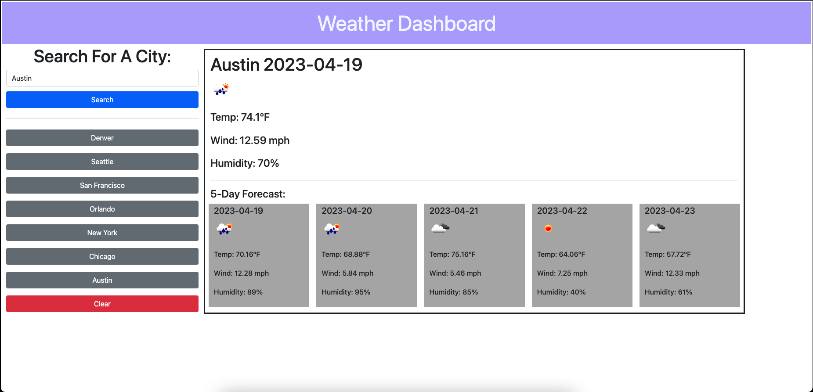

# <Weather-Dashboard>

## Description

- The motivation behind building a 5-day forecast weather project is to provide an easy-to-use platform for users to obtain the latest weather information for their desired location. The project can be useful for anyone who wants to plan their activities in advance or stay updated on the weather conditions in their area.

- The problem that this project solves is the inconvenience of having to navigate through multiple websites or apps to obtain the latest weather information. With this project, users can quickly obtain current and future weather conditions for a particular location with just a few clicks.

- To build this project, a weather dashboard with form inputs was created to allow users to search for a city. When a city is searched, the dashboard presents the user with current and future weather conditions for that city, and the city is added to the search history. The user can then view the current weather conditions, including the city name, date, weather conditions icon, temperature, humidity, and wind speed. Additionally, the user can view the 5-day forecast, which displays the date, weather conditions icon, temperature, wind speed, and humidity. Finally, the user can click on a city in the search history to view current and future weather conditions for that city again.

- Through building this project, one can learn about using APIs to retrieve weather data, integrating this data with a user interface, and manipulating data to display useful information. Additionally, one can learn about using JavaScript and jQuery to build interactive web applications.

## Installation

https://judemdonahue.github.io/Weather-Dashboard/

## Usage

## Credits

- Open Weather API 
- JQuery
- Bootstrap

## License

Refer to license listed in repository (MIT License)

## Badges

